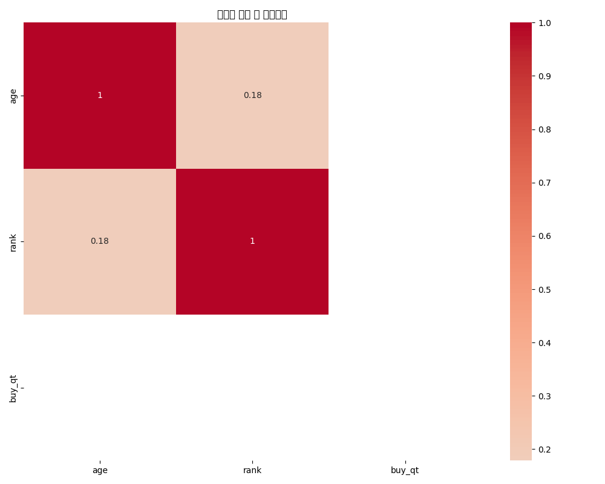

# 고객 데이터 분석 보고서

## 개요 (Executive Summary)

본 보고서는 고객 데이터를 분석하여 연령, 성별, 등급 등 주요 변수 간의 관계와 패턴을 파악하고, 이를 통해 비즈니스 인사이트를 도출하는 것을 목적으로 합니다. 분석 결과, 연령대별 등급 차이, 성별에 따른 구매 패턴, 그리고 상위 등급 고객의 특성 등 다양한 인사이트를 확인할 수 있었습니다. 특히 연령이 증가할수록 평균 등급이 높아지는 경향과, 상위 5% 고객층이 상대적으로 젊은 연령대에 집중되어 있다는 점이 주목할 만한 발견입니다.

## 주요 발견점 (Key Findings)

1. **연령대별 특성**
   - 연령이 증가할수록 평균 등급이 높아지는 뚜렷한 경향이 있음
   - 70대 이상 고객의 평균 등급(약 302만)이 30대 고객(약 169만)보다 약 1.8배 높음
   - 모든 연령대에서 등급의 표준편차가 크게 나타남(약 180-190만)

2. **성별 특성**
   - 여성(평균 약 211만)이 남성(평균 약 206만)보다 약간 높은 평균 등급을 보임
   - 남성 고객의 등급 표준편차(약 192만)가 여성(약 189만)보다 약간 크게 나타남

3. **등급별 연령 특성**
   - 상위 5% 고객의 평균 연령이 42세로 가장 낮음
   - 상위 100% 고객의 평균 연령이 49.1세로 가장 높음
   - 등급이 높아질수록 연령 표준편차가 증가하는 경향을 보임

4. **데이터 분포 특성**
   - 연령 분포는 평균 46.4세, 표준편차 12.8세로 나타남
   - 등급(rank)은 평균 약 213만, 표준편차 약 191만으로 분포가 넓게 퍼져 있음
   - 연령과 등급 간에는 약한 양의 상관관계(0.18)가 존재함

## 상세 분석 (Detailed Analysis)

### 1. 데이터 분포 및 관계 분석

#### 1.1 기본 통계량

분석 데이터의 기본 통계량은 다음과 같습니다:

```
                 age          rank    buy_qt
count  115647.000000  1.172480e+05  117248.0
mean       46.381627  2.132665e+06       1.0
std        12.801608  1.906785e+06       0.0
min        14.000000  1.000000e+00       1.0
25%        36.000000  4.477370e+05       1.0
50%        45.000000  1.496297e+06       1.0
75%        55.000000  3.622921e+06       1.0
max        96.000000  6.291793e+06       1.0
```

주요 변수들의 왜도(skewness)는 다음과 같습니다:
```
age       0.482211
rank      0.671584
buy_qt    0.000000
```

연령과 등급 모두 양의 왜도를 보이며, 이는 분포가 오른쪽으로 치우쳐 있음을 의미합니다.

#### 1.2 변수 간 상관관계

변수 간 상관관계는 다음과 같습니다:
```
             age      rank  buy_qt
age     1.000000  0.180343     NaN
rank    0.180343  1.000000     NaN
buy_qt       NaN       NaN     NaN
```

연령과 등급 사이에는 약한 양의 상관관계(0.18)가 존재하며, 이는 연령이 증가할수록 등급이 높아지는 경향이 있음을 시사합니다.



#### 1.3 수치형 변수 분포

수치형 변수들의 분포는 다음 히스토그램을 통해 확인할 수 있습니다:


연령 분포는 30-50대에 집중되어 있으며, 등급(rank)은 낮은 값에 집중되어 있으나 높은 값까지 넓게 분포하고 있습니다.

#### 1.4 범주형 변수와 구매량의 관계

성별, 연령대, 등급별 구매량 통계는 다음과 같습니다:

**성별 구매량 통계:**
```
          count  mean  std
gendr_nm                  
남자        49105   1.0  0.0
여자        64281   1.0  0.0
```

**연령대별 구매량 통계:**
```
           count  mean  std
age_group                  
20대 이하      7142   1.0  0.0
30대        32549   1.0  0.0
40대        31610   1.0  0.0
50대        25141   1.0  0.0
60대        13460   1.0  0.0
70대 이상      5745   1.0  0.0
기타          1601   1.0  0.0
```

**등급별 구매량 통계:**
```
        count  mean  std
grade                   
상위10%   13714   1.0  0.0
상위100%  35173   1.0  0.0
상위20%   17115   1.0  0.0
상위5%    22899   1.0  0.0
상위50%   28347   1.0  0.0
```

모든 범주에서 구매량의 평균과 표준편차가 동일하게 나타나, 구매량 변수는 분석에 큰 의미를 제공하지 않습니다.


### 2. 심화 분석 결과

#### 2.1 연령대별 등급 분석

연령대별 등급 통계는 다음과 같습니다:

```
                 mean         std  count
age_group                               
20대 이하     2141404.42  1852353.28   7142
30대        1689626.53  1822681.30  32549
40대        2022491.98  1864934.70  31610
50대        2263910.94  1909033.65  25141
60대        2689433.93  1926916.51  13460
70대 이상     3024830.86  1820772.50   5745
기타         3332743.53  1737231.03   1601
```

연령대별 등급 분포를 시각화한 결과는 다음과 같습니다:


분석 결과, 연령이 증가할수록 평균 등급이 높아지는 뚜렷한 경향이 관찰됩니다:
- 30대: 약 169만 (가장 낮음)
- 40대: 약 202만
- 50대: 약 226만
- 60대: 약 269만
- 70대 이상: 약 302만 (가장 높음)

모든 연령대에서 등급의 표준편차가 크게 나타나며(약 180-190만), 이는 각 연령대 내에서도 등급 차이가 크다는 것을 의미합니다.

#### 2.2 성별 등급 분석

성별 등급 통계는 다음과 같습니다:

```
                mean         std  count
gendr_nm                               
남자        2064517.19  1915906.25  49105
여자        2113402.42  1885950.39  64281
```

성별 등급 분포를 시각화한 결과는 다음과 같습니다:


여성(평균 약 211만)이 남성(평균 약 206만)보다 약간 높은 평균 등급을 보이며, 표준편차는 남성(약 192만)이 여성(약 189만)보다 약간 크게 나타납니다. 이는 남성 고객들 간의 등급 차이가 더 크다는 것을 의미합니다.

#### 2.3 등급별 연령 분석

등급별 연령 통계는 다음과 같습니다:

```
         mean    std  count
grade                      
상위10%   43.94  11.46  13660
상위100%  49.14  13.86  34286
상위20%   46.69  12.19  16954
상위5%    42.03  10.49  22854
상위50%   47.56  13.02  27893
```

상위 5% 고객의 평균 연령이 42세로 가장 낮고, 상위 100% 고객의 평균 연령이 49.1세로 가장 높습니다. 등급이 높아질수록 연령 표준편차가 증가하는 경향을 보입니다.


## 결론 및 제언 (Conclusions & Recommendations)

### 결론

1. **연령과 등급의 관계**
   - 연령이 증가할수록 등급이 높아지는 뚜렷한 경향이 있으며, 이는 고연령층이 중요한 고객 세그먼트임을 시사합니다.
   - 그러나 상위 5% 고객층은 평균 연령이 42세로 상대적으로 젊은 편이어서, 젊은 고소비층이 존재함을 알 수 있습니다.

2. **성별과 등급의 관계**
   - 성별에 따른 등급 차이는 크지 않으나, 여성 고객이 약간 더 높은 등급을 보입니다.
   - 남성 고객들 간의 등급 차이가 여성보다 더 크게 나타납니다.

3. **등급 분포의 특성**
   - 모든 연령대와 성별에서 등급의 표준편차가 크게 나타나, 고객 세그먼트 내에서도 구매력의 차이가 크다는 것을 알 수 있습니다.
   - 등급 분포는 양의 왜도를 보이며, 이는 소수의 고객이 매우 높은 등급을 가지고 있음을 의미합니다.

### 비즈니스 제언

1. **연령대별 타겟팅 전략**
   - **30대 고객층 활성화**: 30대 고객층의 등급이 가장 낮으므로, 이들을 위한 특별 프로모션과 마케팅 캠페인을 개발하여 구매력을 높이는 전략이 필요합니다.
   - **고연령층 맞춤 서비스**: 60대 이상 고객층은 평균 등급이 높으므로, 이들의 니즈에 맞는 프리미엄 서비스와 제품을 개발하여 고객 충성도를 강화해야 합니다.

2. **성별 맞춤 전략**
   - **남성 고객 타겟팅**: 남성 고객의 평균 등급이 여성보다 낮으므로, 남성 고객을 위한 특화된 마케팅 전략과 프로모션을 개발하여 구매력을 높일 필요가 있습니다.
   - **여성 고객 로열티 강화**: 여성 고객의 높은 구매력을 유지하기 위한 로열티 프로그램을 강화하고, 여성 고객의 니즈에 맞는 제품과 서비스를 지속적으로 개발해야 합니다.

3. **등급별 차별화 전략**
   - **상위 5% 젊은 고객층 관리**: 상위 5% 고객층이 상대적으로 젊은 연령대에 집중되어 있으므로, 이들을 위한 프리미엄 서비스와 VIP 프로그램을 개발하여 고객 충성도를 강화해야 합니다.
   - **연령대별 차별화 프로그램**: 각 연령대별로 차별화된 등급 상승 프로그램을 운영하여, 모든 연령대의 고객들이 자신의 니즈에 맞는 혜택을 받을 수 있도록 해야 합니다.

4. **데이터 기반 마케팅 강화**
   - 연령과 등급 간의 상관관계를 활용하여, 연령대별 맞춤형 마케팅 전략을 수립하고 실행해야 합니다.
   - 등급 분포의 특성을 고려하여, 등급별로 차별화된 커뮤니케이션과 프로모션 전략을 개발해야 합니다.

이러한 전략을 통해 고객 세그먼트별 맞춤형 접근을 강화하고, 전체적인 고객 만족도와 구매력을 향상시킬 수 있을 것으로 기대됩니다.======