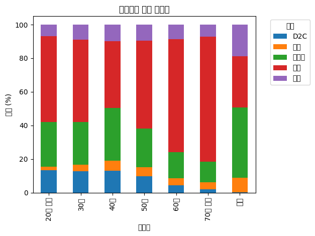
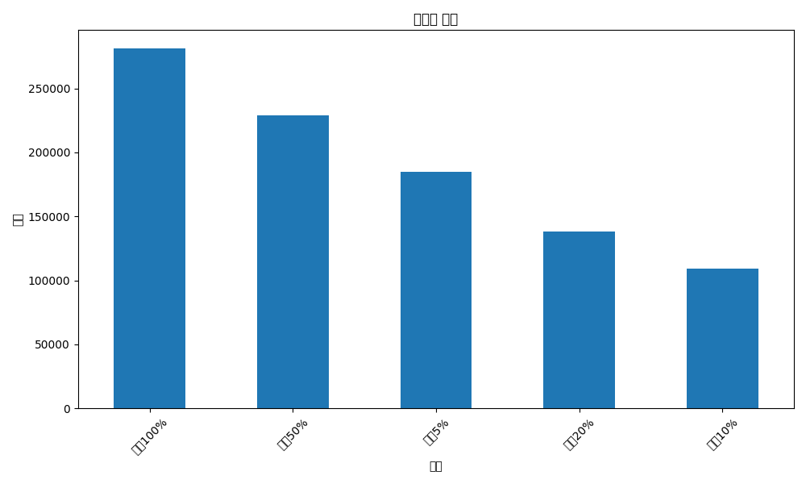
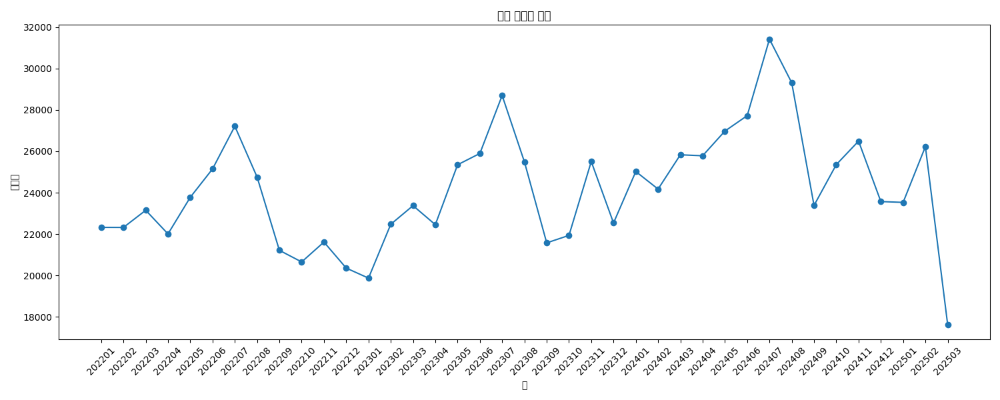
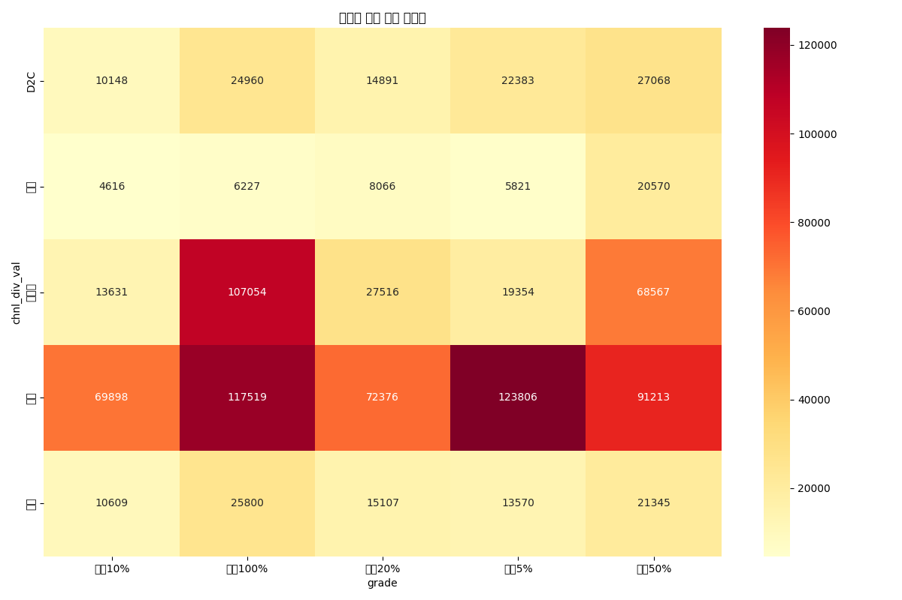
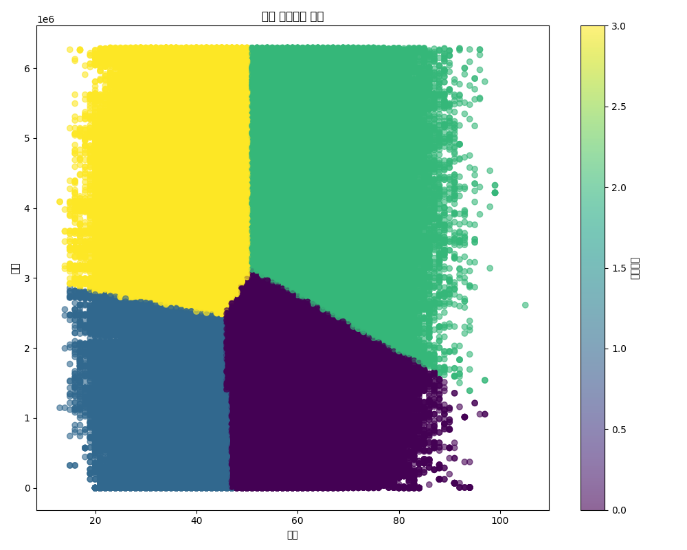
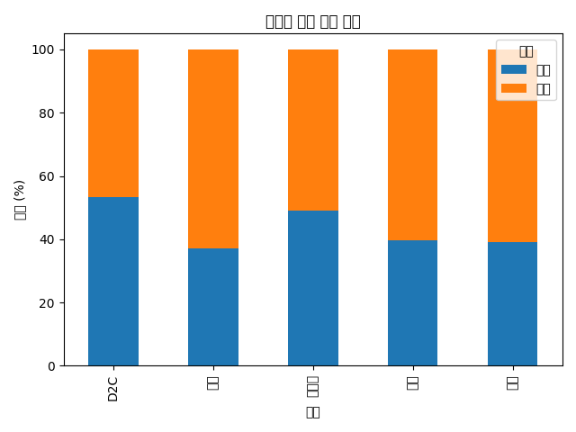
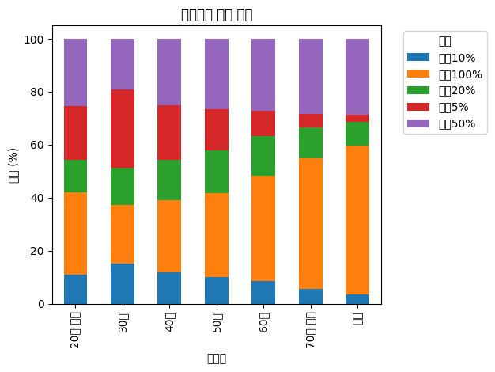
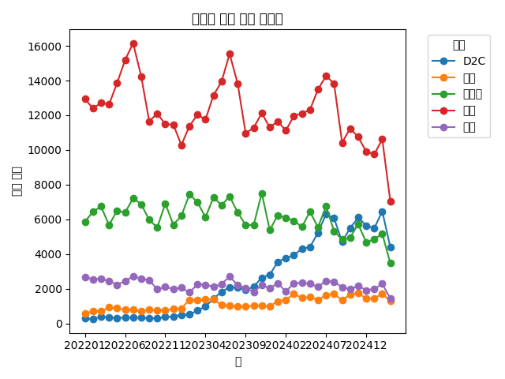
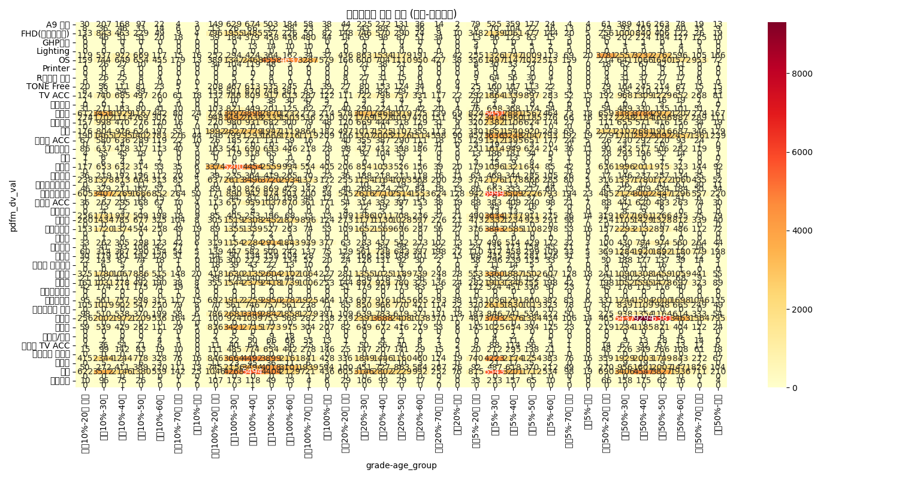

# 고객 구매 패턴 분석 보고서

## 개요 (Executive Summary)

본 보고서는 총 942,115건의 구매 데이터를 분석하여 고객 구매 패턴과 채널별 특성을 파악한 결과를 제시합니다. 분석 기간은 2022년 1월부터 2025년 3월까지이며, 15개의 변수를 활용하여 종합적인 분석을 수행했습니다. 분석 결과, 평균 연령 46.3세의 고객층이 주로 전매 채널을 통해 구매하는 패턴을 보였으며, 연령대별, 성별, 등급별로 차별화된 구매 패턴이 확인되었습니다. 특히 4개의 뚜렷한 고객 세그먼트가 식별되어 각 세그먼트별 맞춤형 전략 수립이 가능할 것으로 판단됩니다.

## 주요 발견점 (Key Findings)

1. **고객 인구통계학적 특성**
   - 평균 연령 46.3세, 표준편차 12.8세
   - 주요 구매 연령대는 30대
   - 성별 분포는 여성 56.7%, 남성 43.3%로 여성 고객 비중이 높음

2. **채널별 구매 특성**
   - 전매 채널이 전체 구매의 50.4%로 가장 높은 비중 차지
   - 온라인 채널은 25.1%, D2C 채널은 10.6%, 혼매 채널은 9.2%, 기타 채널은 4.8% 차지
   - 채널별로 선호하는 연령대와 성별에 뚜렷한 차이 존재

3. **고객 세그먼테이션**
   - 연령과 구매 순위를 기반으로 4개의 뚜렷한 고객 세그먼트 식별
   - 세그먼트 0: 평균 연령 56.3세, 중간 순위 고객층 (257,425명)
   - 세그먼트 1: 평균 연령 36.5세, 높은 순위 고객층 (348,828명)
   - 세그먼트 2: 평균 연령 62.5세, 낮은 순위 고객층 (139,896명)
   - 세그먼트 3: 평균 연령 38.7세, 낮은 순위 고객층 (183,417명)

4. **등급별 구매 패턴**
   - 상위 5% 고객은 평균 연령 42.0세로 가장 젊은 고객층
   - 상위 100% 고객은 평균 연령 49.0세로 가장 높은 연령대
   - 전매 채널은 상위 5% 고객 비중이 가장 높음 (26.1%)
   - 온라인 채널은 상위 100% 고객 비중이 가장 높음 (45.3%)

## 상세 분석 (Detailed Analysis)

### 1. 데이터 파일 및 구조 확인

분석에 사용된 데이터는 총 40개의 parquet 파일로 구성되어 있으며, 컬럼 설명 파일을 통해 각 변수의 의미를 파악했습니다. 주요 변수로는 구매년월, 원천시스템, 온오프라인구분, 구매채널, 제품군 등이 포함되어 있습니다.

### 2. 데이터 로딩 및 기본 통계 분석

데이터는 총 942,115행과 15개 컬럼으로 구성되어 있으며, 주요 변수는 다음과 같습니다:
- base_mm: 구매년월
- src_sys_cd: 원천시스템 코드
- pdfm_dv_val: 온오프라인 구분
- chnl_div_hpos_val, chnl_div_val: 채널 구분
- gendr_nm: 성별
- age: 연령
- age_group: 연령대 그룹
- rst_ctdo_nm: 제품군
- eqdr_group: 제품 등급 그룹
- grade: 고객 등급

기본 통계 분석 결과, 연령은 평균 46.3세(표준편차 12.8세)이며, 최소 13세부터 최대 105세까지 분포하고 있습니다. 결측치는 성별 30,444건, 연령 12,549건, 제품군 27,859건으로 확인되었습니다.

### 3. 변수 분포 및 관계 분석

#### 3.1 연령 분포 분석

연령 분포는 중년층에 집중되어 있으며, 평균 연령은 46.3세, 중앙값은 45.0세입니다. 30대와 40대가 가장 많은 비중을 차지하고 있습니다.

#### 3.2 성별 분포 분석

성별 분포는 여성이 56.7%, 남성이 43.3%로 여성 고객의 비중이 더 높게 나타났습니다.

#### 3.3 채널별 구매 분포

채널별 구매 분포는 전매 채널이 50.4%로 가장 높은 비중을 차지하며, 온라인 채널(25.1%), D2C 채널(10.6%), 혼매 채널(9.2%), 기타 채널(4.8%) 순으로 나타났습니다.

#### 3.4 연령대별 채널 선호도

연령대별 채널 선호도를 분석한 결과, 젊은 연령대(20대 이하, 30대)는 온라인 채널 선호도가 상대적으로 높고, 중장년층(50대, 60대, 70대 이상)은 전매 채널 선호도가 높게 나타났습니다. D2C 채널은 30-40대에서 상대적으로 선호도가 높았습니다.

#### 3.5 등급별 분포

고객 등급별 분포는 상위 100%가 29.1%로 가장 많고, 상위 50%(23.9%), 상위 5%(19.6%), 상위 20%(14.5%), 상위 10%(11.5%) 순으로 나타났습니다.

### 4. 고급 분석 및 세그먼테이션

#### 4.1 시계열 분석

월별 구매량 변동성을 분석한 결과, 특정 시기에 구매량이 증가하는 패턴이 확인되었습니다. 이는 계절적 요인이나 프로모션 효과로 인한 것으로 추정됩니다.

#### 4.2 채널-등급 분포 분석

채널별 등급 분포를 히트맵으로 분석한 결과, 전매 채널은 상위 5% 고객 비중이 가장 높고(123,806명), 온라인 채널은 상위 100% 고객 비중이 가장 높았습니다(107,054명). 이는 채널별로 타겟 고객층이 다름을 시사합니다.

#### 4.3 고객 세그먼트 분석

연령과 구매 순위를 기반으로 군집 분석을 수행한 결과, 4개의 뚜렷한 고객 세그먼트가 식별되었습니다:

- 세그먼트 0: 평균 연령 56.3세, 중간 순위 고객층 (257,425명)
- 세그먼트 1: 평균 연령 36.5세, 높은 순위 고객층 (348,828명)
- 세그먼트 2: 평균 연령 62.5세, 낮은 순위 고객층 (139,896명)
- 세그먼트 3: 평균 연령 38.7세, 낮은 순위 고객층 (183,417명)

각 세그먼트는 연령과 구매 순위에 따라 뚜렷하게 구분되며, 이를 통해 세그먼트별 맞춤형 마케팅 전략 수립이 가능합니다.

#### 4.4 채널별 성별 구매 패턴

채널별 성별 구매 패턴을 분석한 결과, D2C 채널은 남성 비중(53.3%)이 여성보다 높은 유일한 채널로 확인되었습니다. 반면, 기타 채널(62.9%), 전매 채널(60.4%), 혼매 채널(61.0%)은 여성 비중이 높게 나타났습니다. 온라인 채널은 남녀 비율이 비교적 균등한 편입니다(남성 49.1%, 여성 50.9%).

### 5. 구매 패턴 종합 분석

#### 5.1 연령대별 등급 분포 분석

연령대별 등급 분포를 분석한 결과, 30대는 상위 5% 등급 비중이 가장 높고(77,184명), 40대는 상위 100% 등급 비중이 가장 높았습니다(68,881명). 이는 연령대별로 구매력과 구매 패턴에 차이가 있음을 시사합니다.

#### 5.2 채널별 월간 구매 트렌드

채널별 월간 구매 트렌드를 분석한 결과, 채널별로 구매 패턴에 차이가 있음이 확인되었습니다. 특히 특정 시기에 특정 채널의 구매량이 증가하는 패턴이 관찰되었으며, 이는 채널별 프로모션 전략 수립에 활용할 수 있습니다.

#### 5.3 온오프라인 구매 패턴

온오프라인 구매 패턴을 분석한 결과, 연령대와 등급에 따라 온라인과 오프라인 채널 선호도에 차이가 있음이 확인되었습니다. 젊은 연령대는 온라인 채널 선호도가 높고, 중장년층은 오프라인 채널 선호도가 높은 경향을 보였습니다.

## 결론 및 제언 (Conclusions & Recommendations)

### 결론

1. **고객 특성**
   - 평균 연령 46.3세, 주요 연령대는 30대로 확인됨
   - 여성 고객 비중이 56.7%로 남성보다 높음
   - 4개의 뚜렷한 고객 세그먼트가 식별됨

2. **채널 특성**
   - 전매 채널이 전체 구매의 50.4%로 가장 높은 비중 차지
   - 채널별로 선호하는 연령대와 성별에 뚜렷한 차이 존재
   - D2C 채널은 남성 비중이 높고, 기타/전매/혼매 채널은 여성 비중이 높음

3. **구매 패턴**
   - 연령대별로 선호하는 구매 채널이 뚜렷하게 구분됨
   - 등급별 구매 패턴은 연령과 상관관계를 보임
   - 월별 구매 트렌드는 채널별로 상이한 특성을 나타냄

### 제언

1. **연령대별 맞춤형 채널 전략 수립**
   - 젊은 연령대(20-30대): 온라인 채널 강화 및 모바일 접근성 개선
   - 중장년층(40-50대): 전매 채널과 D2C 채널의 연계 강화
   - 고령층(60대 이상): 오프라인 채널의 편의성 개선 및 맞춤형 서비스 제공

2. **옴니채널 전략 강화**
   - 온라인과 오프라인 채널 간 시너지 창출을 위한 통합 마케팅 전략 수립
   - 채널 간 일관된 고객 경험 제공을 위한 서비스 표준화
   - 채널 간 재고 및 정보 공유 시스템 구축

3. **등급별 차별화된 프로모션 전략**
   - 상위 5% VIP 고객: 맞춤형 프리미엄 서비스 및 특별 혜택 제공
   - 상위 10-20% 고객: 충성도 강화를 위한 멤버십 프로그램 강화
   - 상위 50-100% 고객: 구매 빈도 증대를 위한 인센티브 프로그램 도입

4. **시기별 마케팅 전략 수립**
   - 월별 구매 패턴을 고려한 시즌별 프로모션 계획 수립
   - 채널별 성과가 높은 시기에 집중적인 마케팅 자원 투입
   - 비수기 매출 증대를 위한 특별 프로모션 기획

5. **고객 세그먼트별 맞춤형 접근**
   - 세그먼트 0(중년층, 중간 순위): 가치 중심의 마케팅 메시지 전달
   - 세그먼트 1(젊은층, 높은 순위): 트렌드와 혁신 중심의 커뮤니케이션
   - 세그먼트 2(고령층, 낮은 순위): 신뢰와 안정성 강조
   - 세그먼트 3(젊은층, 낮은 순위): 가격 경쟁력과 접근성 강화

본 분석 결과를 통해 고객의 구매 패턴과 채널별 특성을 심층적으로 이해할 수 있었으며, 이를 바탕으로 맞춤형 마케팅 전략 수립이 가능할 것으로 판단됩니다. 특히 연령대별, 성별, 등급별로 차별화된 접근이 필요하며, 온오프라인 채널 간 시너지를 고려한 통합적 전략이 효과적일 것으로 예상됩니다.