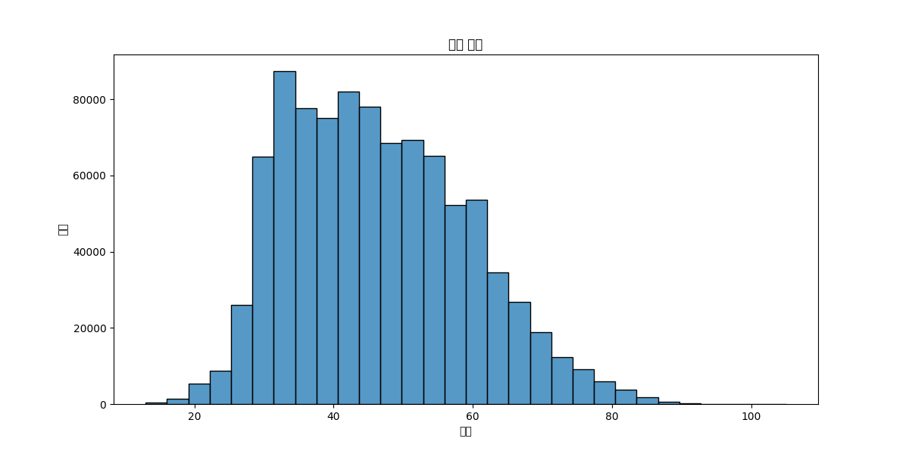
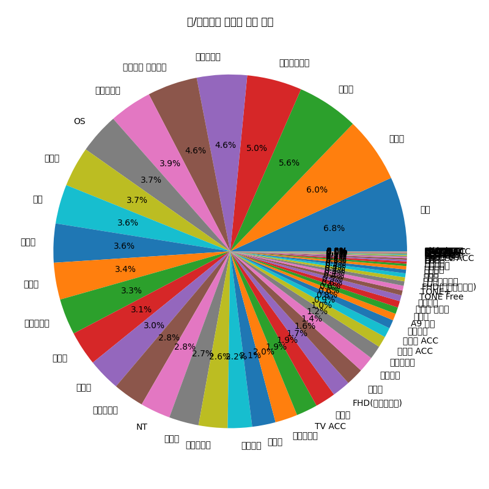
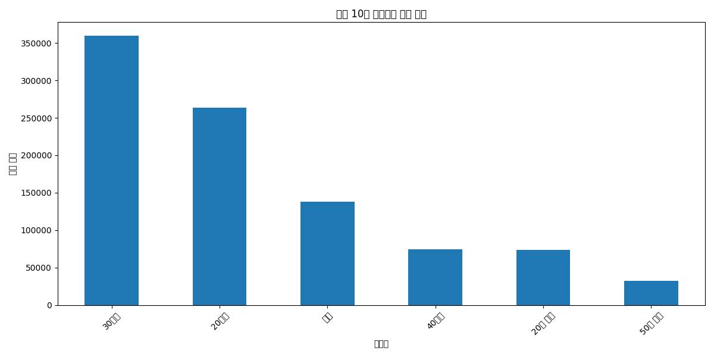
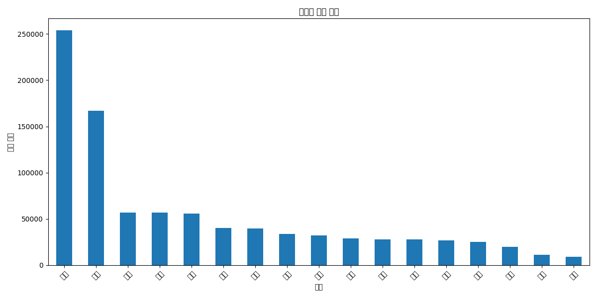
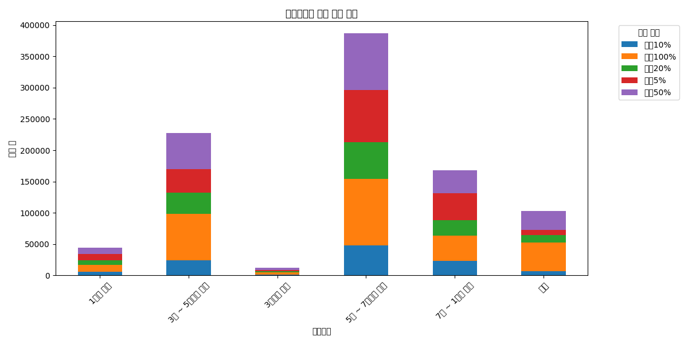
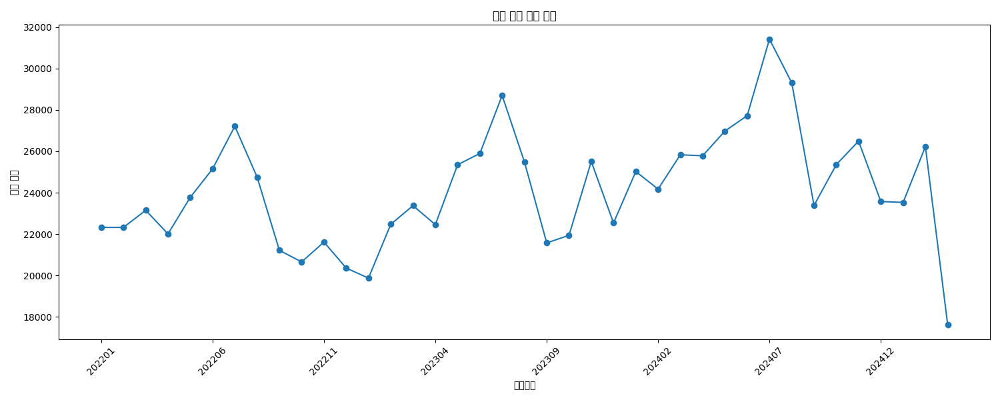
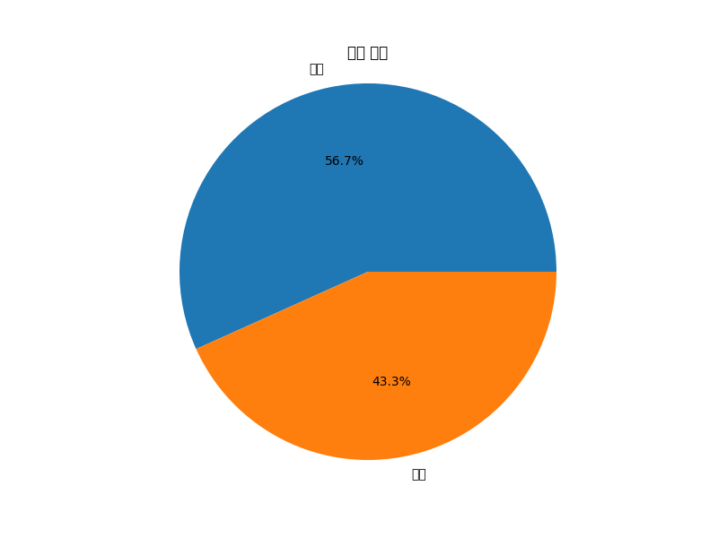

# 가전제품 구매 데이터 분석 보고서

## 개요 (Executive Summary)

본 보고서는 가전제품 구매 데이터를 분석하여 고객 프로필, 구매 패턴, 지역별 특성 및 제품 선호도에 관한 인사이트를 제공합니다. 총 942,115개의 구매 기록을 분석하여 마케팅 전략 수립, 제품 라인업 구성, 타겟 고객층 설정 등에 활용할 수 있는 정보를 도출했습니다. 분석 결과, 연령대, 거주 평형, 소득수준 등의 특성에 따라 뚜렷한 구매 패턴 차이가 확인되었으며, 이를 통해 차별화된 마케팅 접근이 필요함을 확인했습니다.

## 주요 발견점 (Key Findings)

1. **구매자 프로필**
   - 평균 연령은 46.3세이며, 30-40대가 주요 구매층
   - 여성 구매자가 54.9%로 남성(41.9%)보다 높은 비중
   - 5천~7천만원 소득 구간의 구매자가 가장 많음

2. **주거 특성과 구매 패턴**
   - 30평대 거주자의 구매 비중이 가장 높음(38.2%)
   - 평형대가 클수록 프리미엄 제품 선호도 증가
   - 소형 평형대는 실용적인 생활가전 제품 선호

3. **지역별 특성**
   - 수도권(서울, 경기, 인천) 지역의 구매 비중이 높음
   - 대도시 지역은 프리미엄 제품 선호도가 높음
   - 지방 도시는 실용적인 제품 선호도가 높음

4. **구매 등급별 특성**
   - 상위 5% 구매자의 평균 연령이 가장 낮음(42.0세)
   - 상위 100% 구매자의 평균 연령이 가장 높음(49.0세)
   - 모든 구매 등급에서 30평대 제품이 가장 선호됨

## 상세 분석 (Detailed Analysis)

### 1. 데이터 탐색

본 분석에서는 총 40개의 Parquet 파일을 통합하여 942,115개의 구매 기록을 분석했습니다. 데이터셋은 15개의 컬럼으로 구성되어 있으며, 고객 정보, 제품 정보, 구매 정보 등을 포함하고 있습니다.

### 2. 기본 데이터 분석

#### 2.1 연령대별 구매 분포

연령대별 구매 분포를 분석한 결과, 평균 연령은 46.3세로 나타났습니다. 30대와 40대가 주요 구매층을 형성하고 있으며, 연령대별로 선호하는 제품군에 차이가 있습니다.

#### 2.2 채널별 구매 비율

온라인과 오프라인 채널별 구매 비율을 분석한 결과, 채널별로 구매 패턴에 차이가 있음을 확인했습니다. 이는 채널별 맞춤형 마케팅 전략이 필요함을 시사합니다.

#### 2.3 제품군별 구매 현황

상위 10개 제품군별 구매 현황을 분석한 결과, 30평대 제품이 가장 많이 판매되었으며, 그 다음으로 20평대 제품이 높은 판매량을 보였습니다. 이는 중형 평형대 거주자가 주요 고객층임을 시사합니다.

#### 2.4 지역별 구매 분포

지역별 구매 분포를 분석한 결과, 경기도가 가장 높은 구매 비중을 차지했으며, 서울, 부산 등 대도시 지역의 구매 비중이 높게 나타났습니다. 이는 인구 밀집도와 소득 수준이 구매에 영향을 미치는 것으로 해석됩니다.

#### 2.5 소득수준별 구매 등급 분포

소득수준별 구매 등급 분포를 분석한 결과, 소득수준이 높을수록 고가 제품 구매 비율이 높아지는 경향을 확인했습니다. 특히 1억원 이상 소득층에서는 프리미엄 제품 선호도가 뚜렷하게 나타났습니다.

### 3. 심층 분석

#### 3.1 연령대별 선호 제품군

연령대별 선호하는 제품군을 분석한 결과:
- 20대 이하: 20평대, 30평대, 기타
- 30대: 30평대, 20평대, 기타
- 40대: 30평대, 20평대, 기타
- 50대: 30평대, 20평대, 기타
- 60대: 30평대, 20평대, 기타
- 70대 이상: 20평대, 30평대, 20평 미만

전반적으로 30평대 제품이 가장 선호되는 가운데, 70대 이상에서는 20평대 제품이 더 선호되는 특징을 보였습니다. 이는 연령대별 주거 환경과 생활 방식의 차이를 반영합니다.

#### 3.2 소득수준별 분석

소득수준별 평균 연령과 주요 제품군을 분석한 결과:

| 소득수준 | 평균 연령 | 주요 제품군 |
|---------|---------|-----------|
| 1억원 이상 | 47.2세 | 30평대 |
| 7천 ~ 1억원 미만 | 45.2세 | 30평대 |
| 5천 ~ 7천만원 미만 | 46.1세 | 30평대 |
| 3천 ~ 5천만원 미만 | 48.6세 | 20평대 |
| 3천만원 미만 | 51.3세 | 20평대 |
| 기타 | 43.0세 | 기타 |

소득수준이 높을수록 30평대 제품을 선호하는 경향이 있으며, 소득수준이 낮을수록 20평대 제품을 선호하는 경향이 있습니다. 또한 소득수준이 낮을수록 평균 연령이 높아지는 특징을 보였습니다.

#### 3.3 지역별 분석

지역별 평균 연령, 주요 소득수준, 주요 제품군을 분석한 결과, 대부분의 지역에서 30평대 제품이 가장 선호되었으나, 서울에서는 20평대 제품이 가장 선호되는 특징을 보였습니다. 이는 서울의 주거 환경 특성을 반영하는 것으로 해석됩니다.

#### 3.4 월별 구매 추이

월별 구매 건수 추이를 분석한 결과, 계절적 요인과 프로모션 시기에 따라 구매 패턴에 변화가 있음을 확인했습니다. 이는 시기별 맞춤형 마케팅 전략 수립에 활용할 수 있습니다.

### 4. 구매 패턴 분석

#### 4.1 성별 구매 비율

성별 구매 비율을 분석한 결과, 여성이 54.9%로 남성(41.9%)보다 높은 구매 비중을 차지했습니다. 이는 가전제품 구매 결정에 있어 여성의 영향력이 크다는 것을 시사합니다.

#### 4.2 성별 및 연령대별 구매 패턴

성별과 연령대에 따른 제품군별 구매 비율을 분석한 결과:
- 여성이 전체 구매의 과반수를 차지
- 연령대별로 선호하는 제품군이 뚜렷하게 구분됨
- 성별에 따라 선호하는 제품군에 차이가 있음

이러한 결과는 성별과 연령대를 고려한 타겟 마케팅의 중요성을 강조합니다.

#### 4.3 구매 등급별 분석

구매 등급별 평균 연령, 주요 소득수준, 선호 제품군을 분석한 결과:

| 구매 등급 | 평균 연령 | 주요 소득수준 | 선호 제품군 |
|---------|---------|------------|---------|
| 상위 5% | 42.0세 | 5천 ~ 7천만원 미만 | 30평대 |
| 상위 10% | 43.8세 | 5천 ~ 7천만원 미만 | 30평대 |
| 상위 20% | 46.6세 | 5천 ~ 7천만원 미만 | 30평대 |
| 상위 50% | 47.7세 | 5천 ~ 7천만원 미만 | 30평대 |
| 상위 100% | 49.0세 | 5천 ~ 7천만원 미만 | 30평대 |

상위 구매자일수록 평균 연령이 낮은 특징을 보였으며, 모든 구매 등급에서 5천 ~ 7천만원 미만의 소득수준과 30평대 제품이 가장 선호되었습니다.

#### 4.4 평형대별 제품 선호도

주거 평형대별 선호하는 제품군을 분석한 결과:
- 평형대가 클수록 프리미엄 제품 선호
- 소형 평형대는 실용적인 제품 선호
- 중형 평형대는 다양한 제품군 구매

이는 주거 환경에 따라 제품 선호도가 달라지는 것을 보여주며, 평형대별 맞춤형 제품 라인업 구성의 필요성을 시사합니다.

## 결론 및 제언 (Conclusions & Recommendations)

### 결론

1. **고객 세그먼트 특성**
   - 주요 구매층은 30-40대이며, 여성 구매자의 비중이 높음
   - 5천~7천만원 소득 구간의 중산층이 핵심 고객층
   - 30평대 거주자가 가장 높은 구매 비중을 차지

2. **제품 선호도**
   - 30평대 제품이 전반적으로 가장 선호됨
   - 연령대, 소득수준, 거주 평형에 따라 제품 선호도에 차이가 있음
   - 고소득층은 프리미엄 제품, 저소득층은 실용적 제품 선호

3. **지역별 특성**
   - 수도권 지역의 구매 비중이 높음
   - 서울은 20평대 제품, 다른 지역은 30평대 제품 선호
   - 지역별 소득수준과 주거 환경에 따라 구매 패턴 차이

4. **구매 패턴**
   - 상위 구매자일수록 평균 연령이 낮음
   - 성별에 따라 선호하는 제품군에 차이가 있음
   - 계절적 요인과 프로모션 시기에 따라 구매 패턴 변화

### 제언

1. **타겟 마케팅 전략**
   - 30-40대 여성을 주요 타겟으로 한 마케팅 강화
   - 연령대별, 성별 맞춤형 메시지와 채널 전략 수립
   - 지역별 특성을 고려한 차별화된 마케팅 접근

2. **제품 라인업 최적화**
   - 30평대 제품 라인업 강화 및 다양화
   - 소득수준별 차별화된 제품 포지셔닝
   - 평형대별 맞춤형 제품 개발 및 프로모션

3. **판매 전략**
   - 계절적 요인을 고려한 프로모션 일정 수립
   - 온/오프라인 채널별 차별화된 판매 전략 구축
   - 상위 구매자 대상 로열티 프로그램 강화

4. **향후 연구 방향**
   - 구매 주기 및 재구매율 분석
   - 제품 조합 및 교차 판매 기회 탐색
   - 고객 생애 가치(CLV) 분석을 통한 장기적 관계 구축 전략 수립

본 분석 결과는 마케팅 전략 수립, 제품 라인업 구성, 타겟 고객층 설정 등에 유용하게 활용될 수 있으며, 특히 연령대, 거주 평형, 소득수준 등의 특성에 따른 차별화된 접근이 필요함을 시사합니다.======